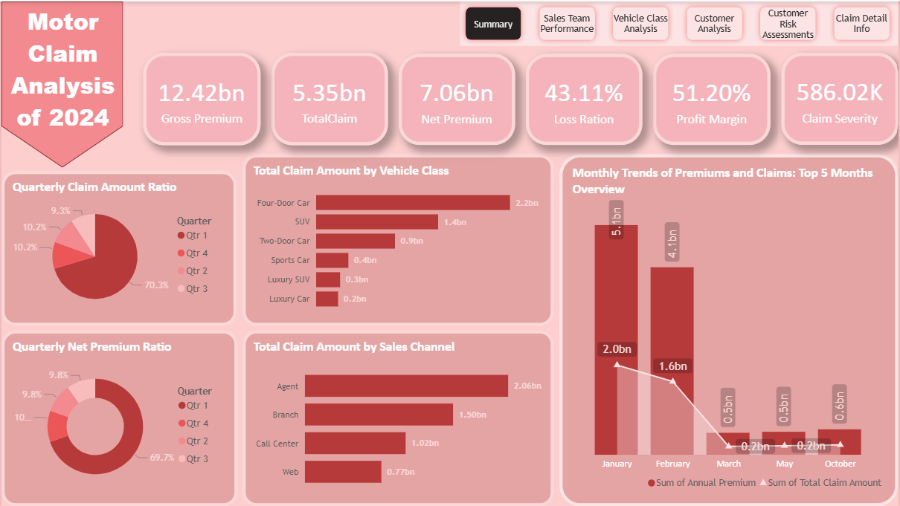
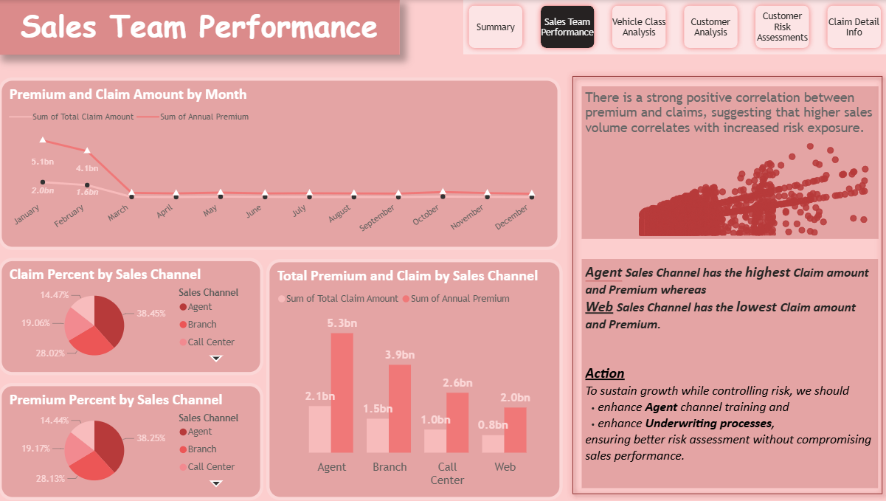
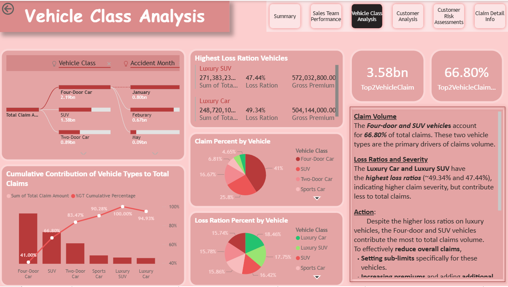
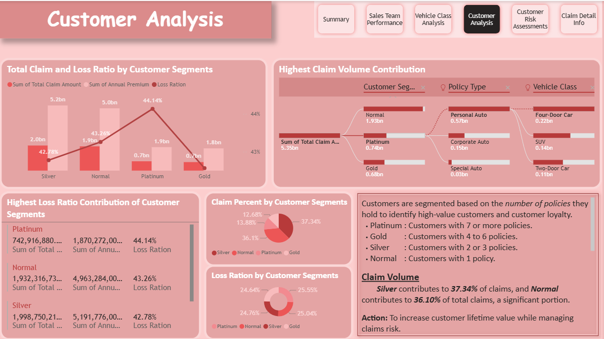

# Motor Claim Analysis – 2024

## Project Overview
This project analyzes 2024 motor insurance claim data using Power BI to uncover claim trends, cost drivers, and risk patterns. The dashboard provides actionable insights to support underwriting decisions, risk assessment, and operational performance improvement within the insurance sector.

## Objectives
* Analyze claim frequency and severity
* Identify high-risk vehicle classes and customer segments
* Monitor sales team performance and monthly claim trends
* Evaluate overall claim cost distribution

## Dashboard Highlights
* Total Claim Amount
* Claims by Vehicle Type
* Sales Team Performance Analysis
* Customer Risk Segmentation
* Monthly Claim Trend Analysis
* Interactive filters for deeper exploration

## Tools & Skills Used
* Power BI
* DAX Calculations
* Data Cleaning & Transformation
* Data Visualization & Storytelling
* Business Insight Generation

## Key Insights
* Certain vehicle classes contribute higher claim costs.
* A small segment of vehicle categories accounts for the majority of total losses.
* Performance variation across sales teams highlights opportunities for targeted training and improved risk awareness.
* Additional data integration could enhance predictive risk modeling capabilities.
* Enhanced underwriting processes can reduce exposure to high-loss segments.

## Dashboard Preview
### Summary

### Sales Team Performance

### Vehicle Class Analysis

### Customer Analysis

## Repository Structure
* [Download Power BI File](motor-claim-analysis-2024.pbix)
* [01-summary.png](01-summary.png)
* [02-sales-team-performance.png](02-sales-team-performance.png)
* [03-vehicle-class-analysis.png](03-vehicle-class-analysis.png)
* [04-customer-analysis.png](04-customer-analysis.png)
* [05-customer-risk-assessments.png](05-customer-risk-assessments.png)
* [06-claim-detail-info.png](06-claim-detail-info.png)
